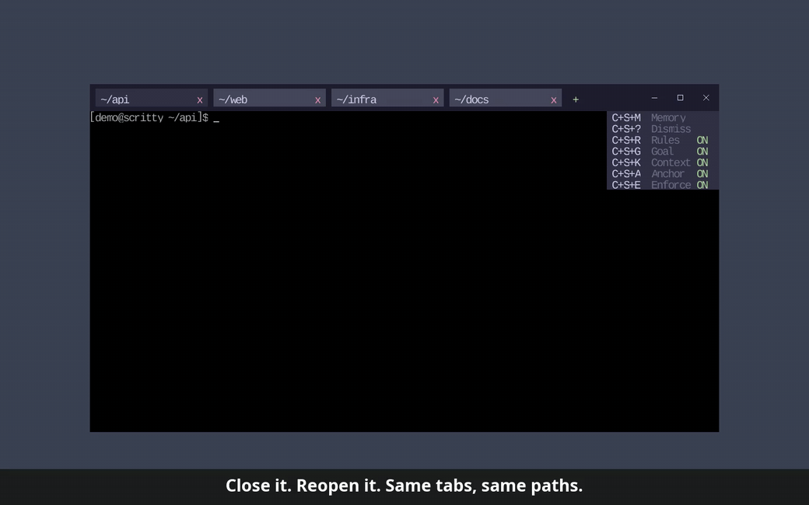

  

<h1 align="center">scritty</h1>

  <strong>One terminal that gives Claude, Codex, Copilot, and Antigravity one shared, searchable memory.</strong>

  <a href="https://scritty.dev">scritty.dev</a> &nbsp;&middot;&nbsp;
  <a href="https://scritty.dev/#demo">3-min demo</a> &nbsp;&middot;&nbsp;
  <a href="https://scritty.dev/#pricing">Pricing</a>

  

  
   
  <em>Ctrl+Shift+M: search every agent's captured conversations, inline, in the terminal.</em>

---

scritty is a terminal emulator you run your AI CLIs inside (Claude Code, OpenAI Codex CLI, GitHub Copilot CLI, Antigravity CLI, Aider, Ollama). It detects which agent is running, captures every exchange, tags it with the provider, and indexes it into one local, searchable memory you control. Then it serves that memory back to your agents over MCP and to you over the CLI.

Your captures stay on your machine. No copy-paste, no per-vendor silos. One agent gives you a searchable memory of your own work; every agent you add shares the same corpus.

> This repository is the public home for scritty: docs, releases, and issues.
> scritty is a paid, closed-source product. Get it at **[scritty.dev](https://scritty.dev)**.

## Why

You run several AI CLIs on the same project and none of them know what the others said. Per-vendor logs are siloed and in different formats. Memory-as-a-service products want you to build an agent around their SDK. scritty captures at the one boundary every CLI agent has to cross, the terminal, so capture is agent-agnostic by construction: no plugins, no SDK, no per-vendor parsing, no elevated capabilities.

## What it does

- **Agent-agnostic capture.** Run any AI CLI inside scritty; it identifies the agent from the process running in the terminal and tags every exchange with the provider.
- **Your default terminal.** Register scritty as your system default terminal on Linux (the `x-terminal-emulator` contract) and Windows (the Default Terminal Application handoff), so every terminal your desktop, file manager, or editor opens is already scritty, already capturing.
- **One corpus across vendors.** A Claude session and a Codex session weeks later about the same bug live in the same store and surface in one query.
- **Hybrid local search.** Vector plus keyword search via Reciprocal Rank Fusion, dual offline ONNX embeddings, one tuned for code and one for prose. All offline.
- **Pluggable vector backend.** Ships with a built-in embedded vector-plus-keyword engine. Swap in qdrant, pgvector, chroma, or weaviate behind one trait.
- **Yours at rest.** Your captures stay on your machine, and opt-in at-rest encryption locks the whole local store -- transcript, keyword index, and vector index -- under a passphrase only you hold, so nothing is readable to another process, another agent, or a synced backup. Agents reach the corpus over scoped tokens, so one can be pinned to a single session and can't widen to everything.
- **One ruleset, every agent.** Write your rules once in `prompt.toml`; scritty assembles them into every message before it reaches whichever agent is running, alongside that vendor's own rule file. Toggle live with `Ctrl+Shift+E/R/G/K`.
- **Use it anywhere.** The terminal embeds a web server; the same session is live on your phone or any browser as a PWA, in sync in real time. TLS is always on, every connection is bearer-token gated, and reaching it beyond your LAN takes an explicit opt-in.
- **Pick up where you left off.** Browser-style tab restore: quit with several tabs open and the next launch brings every one back, each shell already in the directory you left it. Tab pills show each shell's live working directory.

  
   
  <em>Close it. Reopen it. Same tabs, same paths.</em>

## Interfaces

The captured corpus is one engine reachable three ways, all sharing one `MemoryService`:

- **Terminal panel** -- `Ctrl+Shift+M` to search every agent and session inline.
- **MCP server** -- `scritty serve` over stdio for local agents, or `scritty serve --http` over Streamable HTTP (the standard `/mcp` endpoint, bearer-token auth, per-tenant routing) for remote agents. Any MCP-speaking agent can query its own and other agents' prior turns.
- **CLI** -- `scritty memory ...` for scriptable access from any shell or pipeline.

## Get started

scritty is local-first and paid. There is a free 14-day Personal Pilot, then Personal at $19.99/mo. No permanent free tier.

- **Solo developer:** start a free [Personal Pilot](https://scritty.dev/#pricing), then Personal.
- **Team:** a free [Team Pilot](https://scritty.dev/#pricing) (3+ seats), then Pro / Pro Plus / Enterprise, with shared cross-team search, per-org isolation, audit, OIDC and SAML, and a hybrid mode that keeps captured data in your own cloud.

Full details and the demo: **[scritty.dev](https://scritty.dev)**

## Platforms

Linux, Windows, macOS. Desktop, browser, and mobile (PWA).

## Issues and feedback

Bug reports and feature requests are welcome in the [issue tracker](https://github.com/scritty-dev/scritty/issues).

## License

scritty is closed-source and commercially licensed. This repository hosts documentation, releases, and issues only; it does not contain the product source. See [scritty.dev](https://scritty.dev) for terms.
