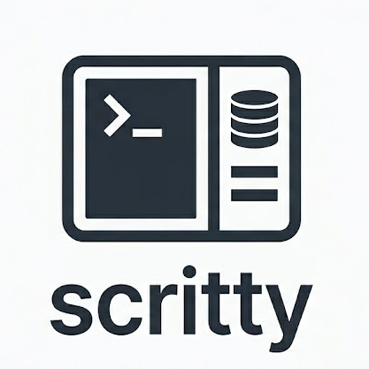
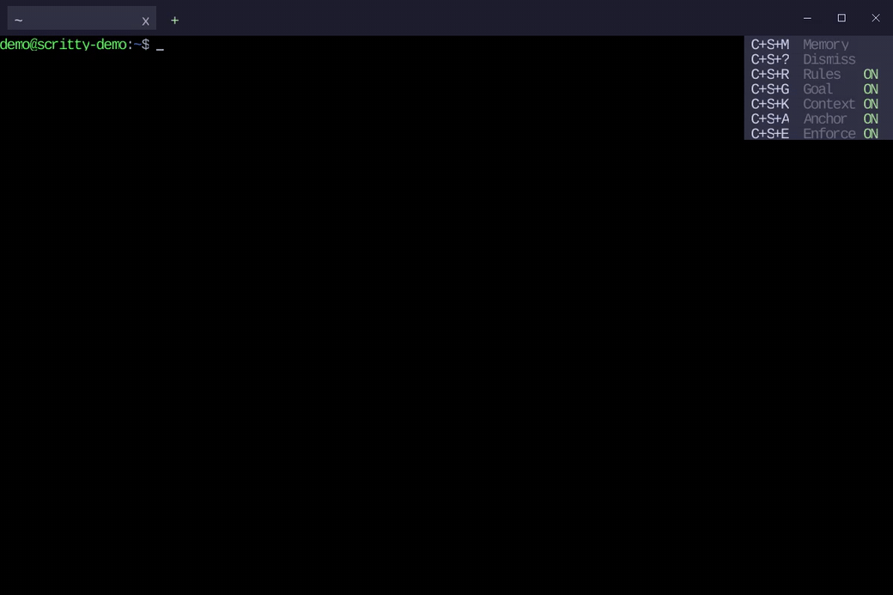
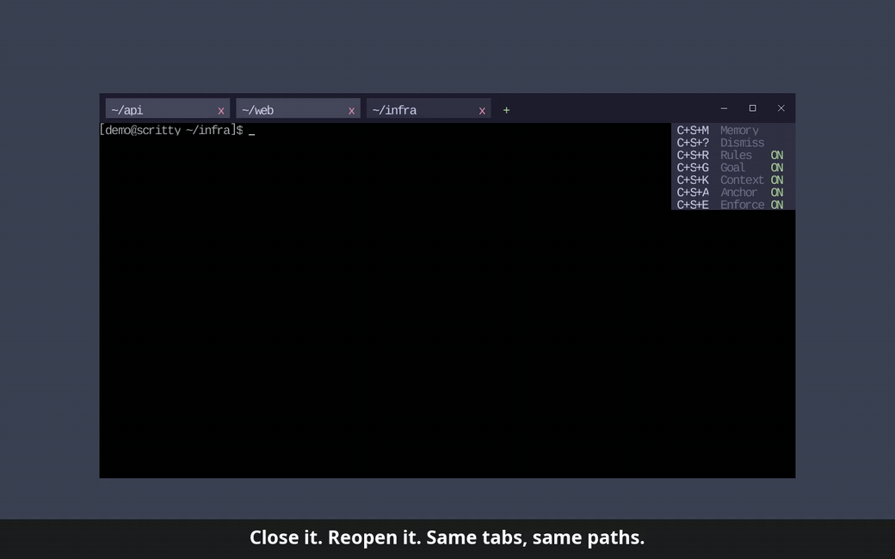

<p align="center">
  
</p>

<h1 align="center">scritty</h1>

<p align="center">
  <strong>One terminal that gives Claude, Codex, Copilot, Gemini, Antigravity, Grok, and Ollama one shared, searchable memory.</strong>
</p>

<p align="center">
  <a href="https://scritty.dev">scritty.dev</a> &nbsp;&middot;&nbsp;
  <a href="https://scritty.dev/#demo">4-min demo</a> &nbsp;&middot;&nbsp;
  <a href="https://scritty.dev/#pricing">Pricing</a>
</p>

<p align="center">
  <a href="https://www.producthunt.com/products/scritty?embed=true&utm_source=badge-featured&utm_medium=badge&utm_campaign=badge-scritty" target="_blank" rel="noopener noreferrer"></a>
</p>

<p align="center">
  
  <br />
  <em>Ctrl+Shift+M: search every agent's captured conversations, inline, in the terminal.</em>
</p>

---

scritty is a terminal emulator you run supported AI CLIs inside (Claude Code,
OpenAI Codex CLI, GitHub Copilot CLI, Gemini CLI, Antigravity CLI, Grok CLI,
and Ollama). It detects which supported agent is running, records each turn it
can attribute -- the prompt scritty submitted and the output the pane wrote
afterwards -- tags it with the provider, and indexes it into one local,
searchable memory you control. Unknown CLIs still run normally but are not
auto-captured until a provider entry is added. Then scritty serves the corpus
back to your agents over MCP and to you over the CLI.

Your captures stay on your machine. No copy-paste, no per-vendor silos. One agent gives you a searchable memory of your own work; every supported agent you add shares the same corpus.

> This repository is the public home for scritty documentation and issues;
> builds are distributed from scritty.dev via the signature-verified installer
> at cp.scritty.dev.
> scritty is a closed-source commercial product with a permanent free
> evaluation tier. Get it at **[scritty.dev](https://scritty.dev)**.

## Why

You run several AI CLIs on the same project and none of them know what the others said. Per-vendor logs are siloed and in different formats. Memory-as-a-service products want you to build an agent around their SDK. scritty captures supported providers at the one boundary every CLI agent has to cross, the terminal, and adding support requires only a provider entry: no plugins, no SDK, no per-vendor transcript parsing, no elevated capabilities.

## What it does

- **Agent-agnostic capture.** Run any supported AI CLI inside scritty; it identifies the agent from the process running in the terminal and tags what it records with the provider.
- **Your default terminal on Linux.** Register scritty through the `x-terminal-emulator` contract so terminals opened by your desktop, file manager, or editor are already scritty. Windows default-terminal registration exists, but the attach bridge is not yet usable; on Windows and macOS, launch scritty and run agents inside it.
- **Runs inside tmux.** scritty works *with* your multiplexer rather than replacing it. It resolves which tmux client owns its terminal by matching pty devices, so capture survives `exec tmux` in your rc file, wrapper scripts, and aliases -- none of which leave a child process to find. Content is the bytes each pane emitted, durably spooled and replayed through a per-pane terminal, so a neighbouring pane cannot contaminate an exchange and two agents in two panes are recorded as separate conversations. Panes that were already open before scritty started are discovered by pane enumeration. Your key bindings stay yours; when scritty cannot prove pane ownership it disables interception rather than guessing.
- **Honest about what it captured.** scritty records the output a pane wrote after a prompt it submitted itself. It does not infer or strip agent UI, so stored text can include prompt echo, progress displays and terminal chrome -- kept because every rule that tried to remove them was measured deleting real answers. Input scritty did not submit (a script's `send-keys`, a second attached client, history recall) is not attributed to a turn. When scritty can name a loss -- a tmux pause, a failed write to its record, or a preserved-output bound -- the exchange carries a visible capture gap rather than being presented as complete. Replies taller than the pane retain lines that scroll out, including inside scroll regions and the alternate screen. A line the application explicitly deletes is treated as an edit and is not preserved or marked as lost.
- **One corpus across vendors.** A Claude session and a Codex session weeks later about the same bug live in the same store and surface in one query.
- **Hybrid local search.** Vector plus keyword search via Reciprocal Rank Fusion, dual offline ONNX embeddings, one tuned for code and one for prose. All offline.
- **Pluggable vector backend.** Ships with a built-in embedded vector-plus-keyword engine. Swap in qdrant, pgvector, chroma, or weaviate behind one trait.
- **Yours at rest.** Your captures stay on your machine, and opt-in at-rest encryption locks the whole local store -- transcript, keyword index, and vector index -- under a passphrase only you hold, so nothing is readable to another process, another agent, or a synced backup. Agents reach the corpus over scoped tokens, so one can be pinned to a single session and can't widen to everything.
- **One ruleset, every supported agent.** Write your rules once in `prompt.toml`; scritty assembles them into every message before it reaches whichever supported agent is running, alongside that vendor's own rule file. Toggle live with `Ctrl+Shift+E/R/G/K`.
- **Use it anywhere.** The terminal embeds a web server; the same session is live on your phone or any browser as a PWA, in sync in real time. TLS is always on, every connection is bearer-token gated, and reaching it from any device other than the machine it runs on takes an explicit opt-in.
- **Pick up where you left off.** Browser-style tab restore: quit with several tabs open and the next launch brings every one back, each shell already in the directory you left it. Tab pills show each shell's live working directory.

<p align="center">
  
  <br />
  <em>Close it. Reopen it. Same tabs, same paths.</em>
</p>

## Interfaces

The captured corpus is one engine reachable three ways, all sharing one `MemoryService`:

- **Terminal panel** -- `Ctrl+Shift+M` to search every agent and session inline.
- **MCP server** -- every tier can run `scritty serve` over stdio for local
  agents. A current Team Pilot, Pro, Pro Plus, or Enterprise licence adds
  `scritty serve --http` over Streamable HTTP for remote agents; public binds
  require Enterprise. Any MCP-speaking agent can query its own and other
  agents' prior turns.
- **CLI** -- `scritty memory ...` for scriptable access from any shell or pipeline.

## Get started

**Free to evaluate, permanently.** Every binary carries a signed evaluation licence, so there is no credit card, no account, no signup, and no network call:

**Linux and macOS (Apple Silicon):**

```sh
curl -fsSL https://cp.scritty.dev/install.sh | sh -s -- evaluation
```

**Windows PowerShell:**

```powershell
$env:SCRITTY_TOKEN="evaluation"; iwr -useb https://cp.scritty.dev/install.ps1 | iex
```

It is bounded by usage rather than a clock -- 25,000 captured exchange-pairs -- and reaching that cap pauses **new capture only**. Everything already captured stays searchable, exportable and curatable forever, offline.

- **Solo developer:** **Personal, $99.99 once.** Bought outright and owned forever: unlimited capture, and a licence that never expires and never contacts us -- no heartbeat, no account, no kill switch. The first year of updates is included; after that new builds are an optional $39.99/yr, and letting that lapse changes nothing about the copy you already have.
- **Team:** a free [Team Pilot](https://scritty.dev/#pricing) (3+ seats) and Pro provide shared cross-team search, tenant-scoped audit, and Google / GitHub OIDC. Pro Plus adds SAML and longer audit retention. Enterprise adds dedicated isolation and a hybrid mode that keeps captured data in your own cloud. Local capture is unlimited on every paid tier.

Full details and the demo: **[scritty.dev](https://scritty.dev)**

## Platforms

Linux, Windows, macOS (Apple Silicon). Desktop, browser, and mobile (PWA).

## Issues and feedback

Bug reports and feature requests are welcome in the [issue tracker](https://github.com/scritty-org/scritty/issues).

## License

scritty binaries, including the free evaluation build, are closed-source and distributed under the commercial binary-licence branch rather than the AGPL source-code option. This repository hosts documentation and issues only; it does not contain the product source. See [scritty.dev](https://scritty.dev) for product details.
